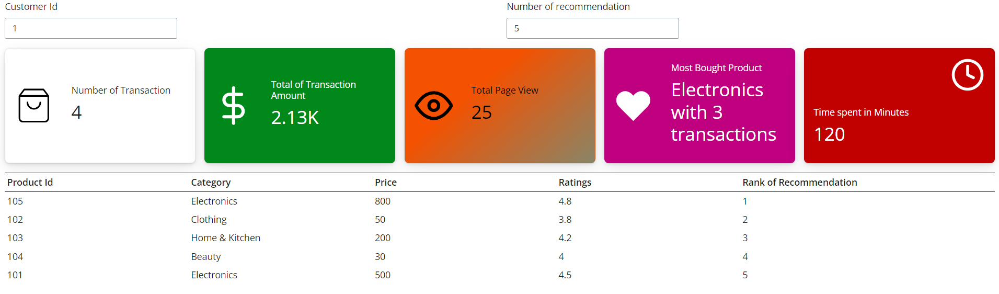

## Getting started

This repository created in order to fulfill the technical test as a Mentor AI in Skilvul. The task is to create a recommendation engine using AI model. Then build a web application to deploy the model.

In this case I am using *shiny* from posit.co (formerly Rstudio), shiny is web application that provided for R. However, lately they support the package for Python. I am using this because the ease of use as well as they provide free deployment for the web application.

## Accessing the web application

please visit this link to access the web application : https://zaenal.shinyapps.io/skilvul-test-3/


## How to run this code.

in order to run this code make sure you are using python version 3.9.16 or latest. Then install the package requirements by typing this command.

```
git clone https://github.com/zaenalium/skillvul-test.git

cd skillvul-test
pip install -r requirements.txt
```


After install all the requirements, then we can start running the main code by using this command 


```
## make sure you are still in the same directory same as the command above

shiny run --reload --launch-browser app.py 

```

Then open the browser visit this address http://127.0.0.1:8000/.  Then you will get the web application as follow:



Please input the Customer Id for the selected Id that use want to check, and input the "Number of Recommendation" for how many of the recommendations. Please be noted, since we only have 5 users. The Id that allowed input is only 1, 2, 3, 4 and 5, and the recommendation also have maximum 5 number of recommended product.